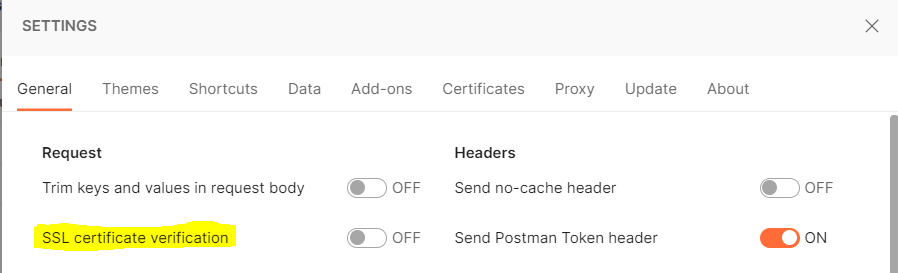
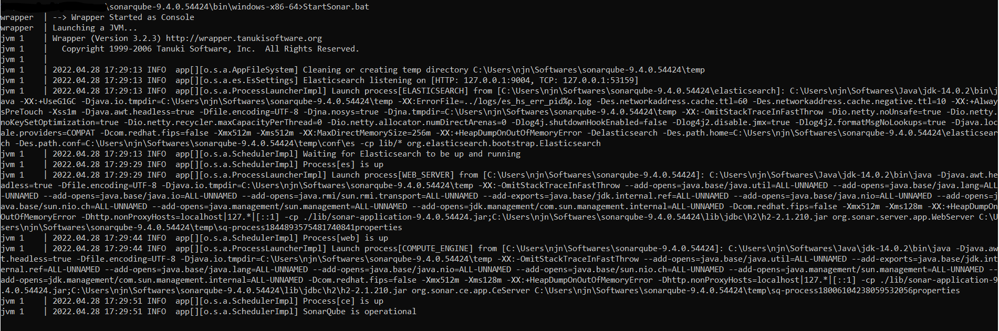
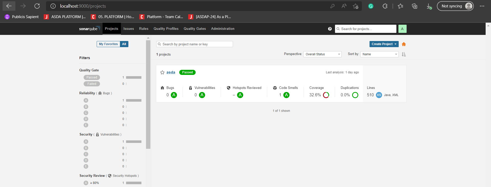
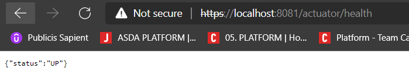
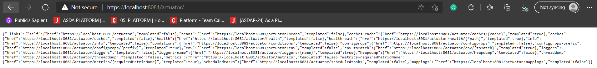
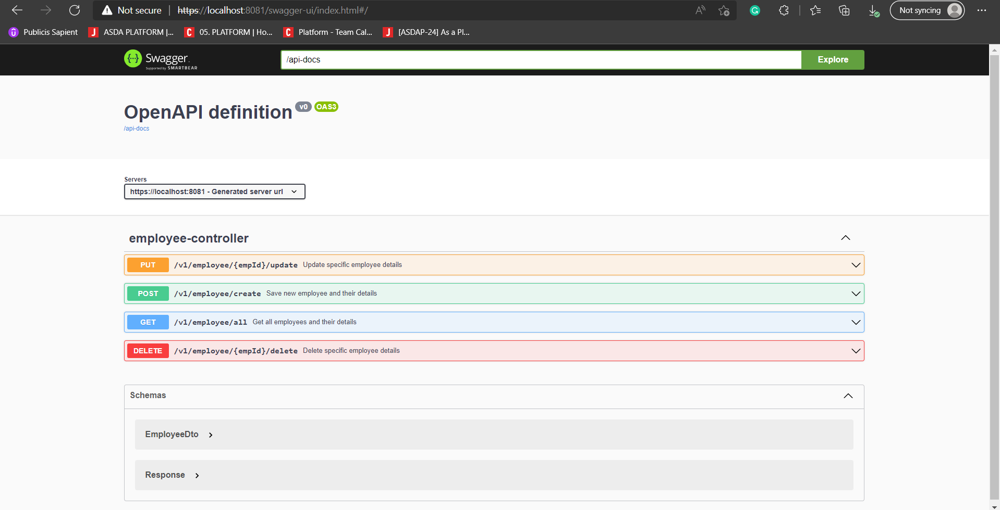

#asda-microservice-template

This service provides as a template for java based microservices in ASDA.

Below are the details of plugins added, dependencies used and other features of this project.

## Built with
1. Java 1.8
2. Spring Boot 2.6.4
3. Spring Security
4. Spring AOP for Logging
5. Spring OpenDoc API
6. Spring Actuator
7. Spring JPA
8. H2 Database
9. Log4j2
10. Lombok
11. Cucumber
12. Apache H2 Database

## Installation
1. Download the code from Git onto your machine
2. Build the code using the mvn command below. This should also execute the test cases written for the code.
```
mvn clean install
```

## Prerequisites

PLEASE NOTE: This document is built based on the  assumption that the server port is set to 8081.

### H2 Database Configuration
The service uses InMemory Apache H2 Database. Configuration for the same is from the `application.properties` file. 
The DB can be changed from in memory to a flat file based DB by changing the respective property.
Transaction with the H2 DB is done using Spring JPA.
```
spring.datasource.url=jdbc:h2:file:<Absolute location of db>
```

### Spring Security
1 way SSL has been enabled on the service. This means the service user will need to perform basic authentication; credentials and configurations for which are found in the `application.properties` file.

**As a prerequisite, please disable `SSL Certificate Verification` on Postman before executing the respective API calls**. This will disable the cert verification on the client end ie., Postman.


### Aspect Logging
Spring AOP is configured to provide logs of the service, when the control enters and exits any method. Along with the method name, the log also displayed the arguments that are passed into the method.

The property `aspect.log.enable` serves as a switch for the same. This is a custom property and not from Spring itself.
```
if (aspectLogEnable) {
    LOGGER.info("{} has started execution.", pjp.getSignature());
}
Object resultOfMethodCall = pjp.proceed();
if (aspectLogEnable) {
    LOGGER.info("{} finished execution", pjp.getSignature());
}
```

## Quality check
The service is configured with SonarQube and all executable code is considered for Sonar Quality evaluation.

Configuring SonarQube locally can be done by following the steps below
1. Download Sonar onto your computer from [here](https://www.sonarqube.org/downloads/)
2. Once installed, navigate to the SonarQube directory -> conf and double check all the required properties in sonar.properties and wrapper.conf. **You will need to set the value of `wrapper.java.command` inside the wrapper.conf file to point to the jdk/bin folder**
3. Then navigate to SonarQube directory -> bin -> windows and open StartSonar.bat. This should start the SonarQube server locally.

4. After the server starts, open `http://localhost:9000` to open the SonarQube portal.
SonarQube is now successfully installed on your system.


Remember, the host URL and port can be changed by changing them in the `application.properties` file. 

If you do so, please remember to double-check the ports of other services like Elastic-Search, that are bundled with Sonar. Properties of these bundled services can be checked on `sonar.properties` file.

To check if the service is Sonar compliant
1. Check the properties on the `sonar.properties`
2. Use the below command to evaluate code coverage and push the sonar coverage and quality reports onto the SonarQube UI
```mvn clean jacoco:prepare-agent install jacoco:report sonar:sonar```
**PLEASE NOTE: The maven goals have to be provided in that specific order.** Interchanging them may not generate the required data to evaluate code coverage or publish them to SonarQube.

## Application startup
After the code is built and installed, the application is ready to start using `java -jar` and/or `mvn springboot:run`.

Use the Spring Actuator's health check URL to verify if the application has started successfully.
```https://localhost:8081/actuator/health```


## Dockerising the service
An image of the service can be built using the standard `docker build .` command. But this is to be done only after the application is build and the jar executable is created.

The service contains a _DockerFile_ in the root location that can be used to build the docker image for deployment.
Use the below commands to containerize the service and run it accordingly

1. `docker build --tag=asda-microservice-template:latest .`
2. `docker run -p8081:8081 asda-microservice-template:latest`

## Usage
The service is used to manage employee records in the application. Basic authorization has been added with username and password configurable in the `application.properties` file(_Currently set to user:user_)

The service also provides for multiple actuator functions. They can be accessed via `https://localhost:8081/actuator` endpoint. The above URL gives a list of all the available actuator APIs configured for the particular service.
For example, `https://localhost:8081/actuator/health` helps check the health of the service; if the service is up and running or not, `https://localhost:8081/actuator/info` provides details about the service and the APIs available.


More information on the service, and it's usage can be observed on the Spring OpenDoc API `https://localhost:8081/swagger-ui/index.html#` of the service.
Swagger OpenDoc API provide more details specific to the APIs of the service, as below.


## Run Tests

To run all the tests in the service, use any 1 of the below mvn command
```
mvn clean test
mvn clean verify
mvn clean install
```

These commands will run the JUnit test cases and the Cucumber Integration tests as well.
In order to skip the Cucumber Integration test, comment the below line in CucumberIntegrationTest.java
```
@RunWith(Cucumber.class)
```